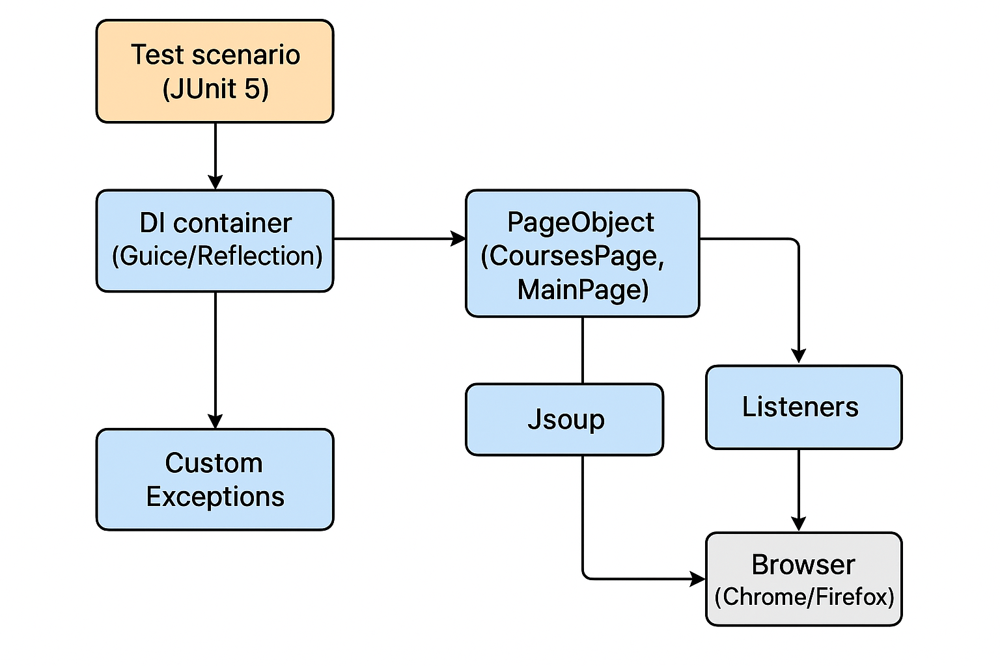

# Проект UI автотестов для Otus-Java-QA-Auto

## 🚀 Описание проекта
Проект содержит автоматизированные UI-тесты для сайта [OTUS](https://otus.ru), написанные на Java с использованием Selenium WebDriver 4+.  
Основные цели проекта:
- Проверка отображения и работы каталога курсов.
- Работа с данными на страницах с помощью **Stream API** и **Jsoup**.
- Демонстрация применения DI, Listener’ов, кастомных Exception’ов и 2-уровневого тест-дизайна.
- Создание Фабрики и её реализация
- Все автотесты запускаются параллельно в многопоточном режиме

---

## 🛠️ Стек технологий
- **Java 17+**
- **Selenium WebDriver 4+**
- **JUnit 5**
- **Stream API**
- **Jsoup**
- **Dependency Injection** (Google Guice / Reflection)
- **Maven** (сборка и запуск тестов)
- **Checkstyle + SpotBugs** (статический анализ кода)
- **Screenshots** (Скриншоты упавших тестов)

---

## 📂 Архитектура проекта
- `pages/` — PageObject классы
- `tests/` — тестовые сценарии
- `exceptions/` — кастомные исключения
- `Factory/` — настройка баузеров и WebDriverFactory
- `listeners/` — слушатели WebDriver (подсветка элементов)
- `resources/` — checkstyle.xml

## Схема взаимодействия

### ▶️ Как запустить
1. Склонировать репозиторий:
   ```bash
   git clone https://github.com/your-repo/otus-tests.git
    ```
2. Установить зависимости:
   ```
   mvn clean install
    ```
3. Запустить тесты:
   ```
   mvn test
   ```
## Описание сценариев
### Сценарий 1

- Открыть страницу каталога курсов https://otus.ru/catalog/courses.
- Найти курс по имени (имя курса передаётся в тесте).
- Кликнуть по плитке курса и проверить, что открыта страница верного курса.
- поиск по имени курса реализован через Stream API.

### Сценарий 2

- Открыть страницу каталога курсов https://otus.ru/catalog/courses.
- Найти курсы, которые стартуют раньше и позже всех.
- если даты совпадают → выбрать все курсы.
- Проверить, что на карточке самого раннего/позднего курса отображаются корректные название и дата.
- поиск через Stream API + reduce.
- проверка через Jsoup.

### Сценарий 3

- Открыть главную страницу https://otus.ru.
- В заголовке страницы открыть меню «Обучение».
- Выбрать случайную категорию курсов.
- Проверить, что открыт каталог курсов нужной категории.